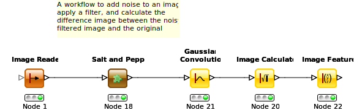

# Exercise 2: Image Enhancement


## Downloading the data
1. The data for the example can be downloaded from [here](https://github.com/kmader/Quantitative-Big-Imaging-Course/blob/master/Ex2/matlab.zip?raw=true)
2. Open the file in Archive Manager and extract the data to ```/scratch``` (only on D61.1 machines)

## Getting Started
- Steps are shown in normal text, comments are shown in _italics_.

- Knime Basics: [here](https://github.com/kmader/Quantitative-Big-Imaging-2015/wiki/KNIME-Setup)
- Install latest image processing extensions [here](https://github.com/kmader/Quantitative-Big-Imaging-2015/wiki/KNIME-Setup#installing-the-latest-image-processing-extensions)
- Use workflow variables: [here](https://github.com/kmader/Quantitative-Big-Imaging-2015/wiki/KNIME-Setup#workflow-variables)

### Part 1 - Images, Resizing, Noise, and Filters



Video - Coming soon


1. Start KNIME (click OK for default workspace)
1. Go to File->New... and Select 'New Knime Workflow'
1. Create an 'Image Reader' node and right click 'Configure'
 1. Go to the 'Options' tab
 1. Select the files from the downloaded folder called 'matlab/data' (```asphalt_bilevel.tif, asphalt_gray.tif, scroll.tif, testpattern.png, wood.tif```)
 1. Select all of the files and click 'Add Selected'
 1. Right click and select 'Execute and Open Views'
 1. _Here you see the names and previews of the images loaded_
1. Create an 'Image Cropper' 
 1. Connect this node with the 'Image Reader'
 1. Right click and select 'Configure'
 1. _Here you select the region of the image that should be kept, the default is the 'All' box checked which keeps all of the data_
 1. Uncheck the 'All' box next to x and y
 1. Type 100-150 in the field next to x to keep the pixels between 100 and 150
 1. Type 0-100 in the field next to y to keep the pixels between 0 and 100
 1. Right click and select 'Execute and Open Views'
1. Create an 'Image Resizer' 
 1. Connect this node with the 'Image Reader'
 1. Right click and select 'Configure'
 1. _Here you can resize the images through scaling, in each direction, the default values (for relative scaling) are 1.0 which means no rescaling_
 1. Change the values for X and Y to 0.5
1. Create an 'Image Converter' node
 1. Connect this node with the 'Image Reader'
 1. Right click and select 'Configure'
 1. Select 'FLOATTYPE' for the Target Type
 1. _This node converts the image to a double/floating point value so we can add fractions of a value to it, and it won't start clipping or saturating when the value exceeds 255_

#### Add Noise to the Image

To add noise to the image we use the various noise adding tools available from 'Community Nodes -> KNIME Image Processing -> ImageJ2 -> Process -> Noise' 

1. Create a 'Salt and Pepper' node
 1. Connect it to the 'Image Reader' node
 1. Right click and select 'Configure'
 1. Uncheck the 'Use data min and max' box.
 1. Set 'Salt Value' to 255
 1. Set 'Pepper Value' to 0
 1. Go to the 'Column Selection' tab
 1. Change 'Column Creation Mode' to 'Append'
 1. _We want to keep the original image for comparison_
 1. Change 'Column Suffix' to '_sp_noisy'
 1. _We want the noisy image to have a meaningful name (default would be Image (#2))_
 
#### Filter the Images

To filter the images we can use the large selection of filters available from 'Community Nodes -> KNIME Image Processing -> Image -> Filters' even more are available in 'Community Nodes -> KNIME Image Processing -> ImageJ2 -> Process -> Noise -> Noise Reduction'. We shall start with the first group and selec the 'Gaussian Convolution'

1. Create a 'Gaussian Convolution' node
 1. Connect it to the 'Salt and Pepper' node
 1. Right click and select 'Configure'
 1. Set 'Sigma Value' to 2.0
 1. Go to the 'Column Selection' tab
 1. Change 'Column Creation Mode' to 'Append'
 1. _We want to keep the original image for comparison_
 1. Change 'Column Suffix' to '_sp_noisy'
 1. _We want the noisy image to have a meaningful name (default would be Image (#2))_

 
 
 
 
#### Calculate SNR

Here we calculate the SNR using the 'Image Calculator' to create a difference image (between the filtered noisy image and the original) and then the 'Image Features' to calculate the mean value.

1. Create a 'Image Calculator' node
 1. Connect this node with the 'Cross Joiner'
 1. Right click and select 'Configure'
 1. Type in the 'Expression' field ```$Image$+$scale_noise$``` to add the image and the noise together
 1. Select the 'New Table' option and type in a nice name like ```noisy_image```
 1. Select 'FLOATTYPE' for the Result pixel type
 1. Right click and select 'Execute and Open Views'
 1. Click the 'Normalize' checkbox to rescale the colors so the contrast in the image is visible (otherwise it shows from -1e30 to 1e30 which makes the whole image gray)


## More information about KNIME
1. KNIME Website: http://knime.org
2. Examples, Tutorials, Webinars on KNIME Image Processing: http://knime.imagej.net
3. Need help? Ask in the KNIME Forum: http://tech.knime.org/forum
