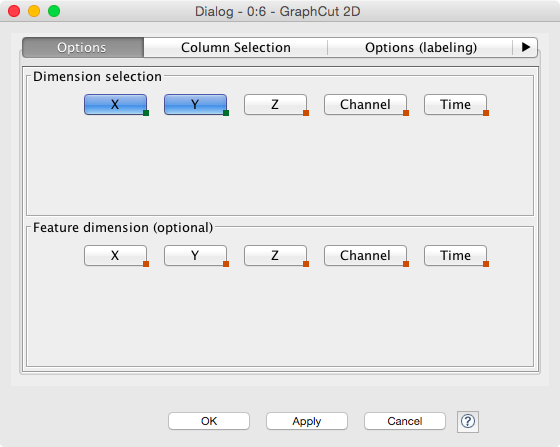

# Exercise 5: Machine Learning in Image Processing

## Downloading the data

You can use [this image](05-files/1_29_s.bmp) or re-use data from a previous exercise.

## Part 1 - Graph-cuts

Basic Workflow

1. Start KNIME (click OK for default workspace)
1. Import the above Workflow from an Archive
1. Right click the image reader to make sure it has downloaded, otherwise you can use your own test image and import it using the 'Image Reader' (make sure to remove the old one first)
1. Right click the 'Loop End' node and click 'Execute'
1. View the output and it (scroll left) should look like the following table

You can see that the result is not really good yet as GraphCut tend to remove the non-smooth parts (e.g. the legs in this example). Can you think of ways to improve the results?
