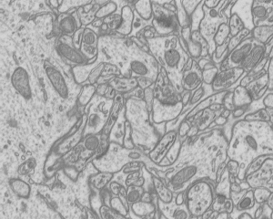

# Exercise 5: Machine Learning in Image Processing

## Downloading the data

You can use [this image](05-files/1_29_s.bmp) or re-use data from a previous exercise.

## Part 1 - Graph-cuts

Basic Workflow

1. Start KNIME (click OK for default workspace)
2. Download this [workflow](05-files/KNIME_GraphCut.zip)
3. Import the above Workflow from an Archive
4. Right click the image reader to make sure it has downloaded, otherwise you can use your own test image and import it using the 'Image Reader' (make sure to remove the old one first)
5. Right click the 'Loop End' node and click 'Execute'
6. View the output and it (scroll left) should look like the following table

You can see that the result is not really good yet as GraphCut tend to remove the non-smooth parts (e.g. the legs in this example). Can you think of ways to improve the results?

## Part 2 - Image classification in Matlab

We here provide matlab code to train a classifier (you can choose one among SVM, GP, Perceptron or Decision tree) to detect objects specified in a set of ground-truth images. Some images and the associated ground-truth images are provided for the segmentation of mitochondria in Electron microscopy images.

 

1. Download the zip file containing the code [here](http://lucchia.free.fr/code/segmentation.zip)
2. Run main.m
3. You should get an image in the "predictions" directory like the one below. 

Note that the default classifier is a Perceptron algorithm. If you want to use SVM you need to download the libSVM code from [here](http://www.csie.ntu.edu.tw/~cjlin/libsvm/). You will then need to add the path pointing to the libsvm files with the matlab function addpath.

### Tasks (can be done in any order you like)
1. Change the size of the patches (variable opts.patchSize in main.m). What effect does it have on the output of the classifier? 
2. Change the number of positive and negative examples (variables opts.pos_examples and opts.neg_examples) and observe how the confidence of the classifier varies.
3. Change the set of training and test images. You can either use your own images or use [this set of EM images](http://lucchia.free.fr/Mitochondria/EM_images.zip)

#### Use a different set of training and test images
For that, you need to change the following variables:

opts.trainImgFolder = './train/images_mitochondria/';

opts.trainAnnFolder = './train/annotations_mitochondria/';

opts.testImgFolder = './test/images_mitochondria/';

opts.testAnnFolder = './test/annotations_mitochondria/';

#### Comments
Note that the code will error if you try to extract more patches than available in the training data, in which case you should increase the number of training images (if possible) or reduce the number of samples.

