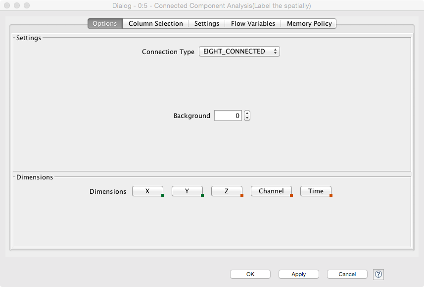
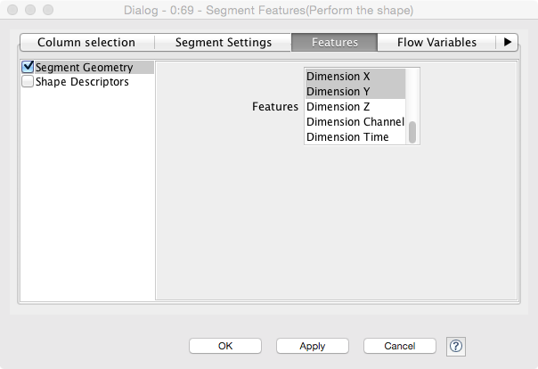
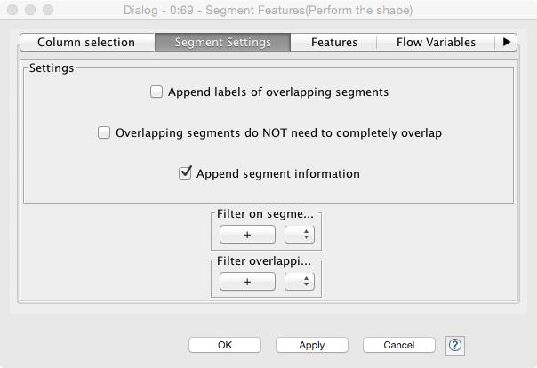
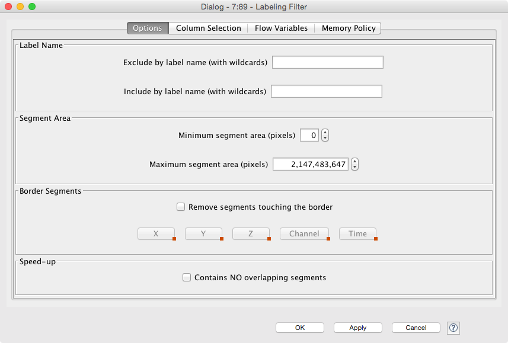
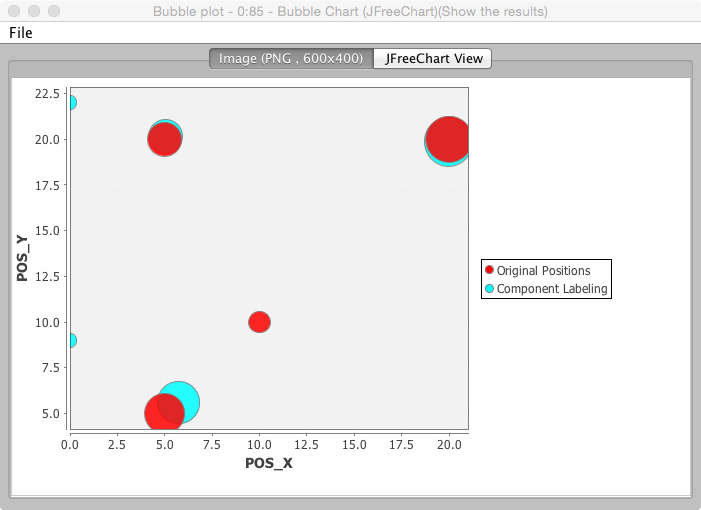
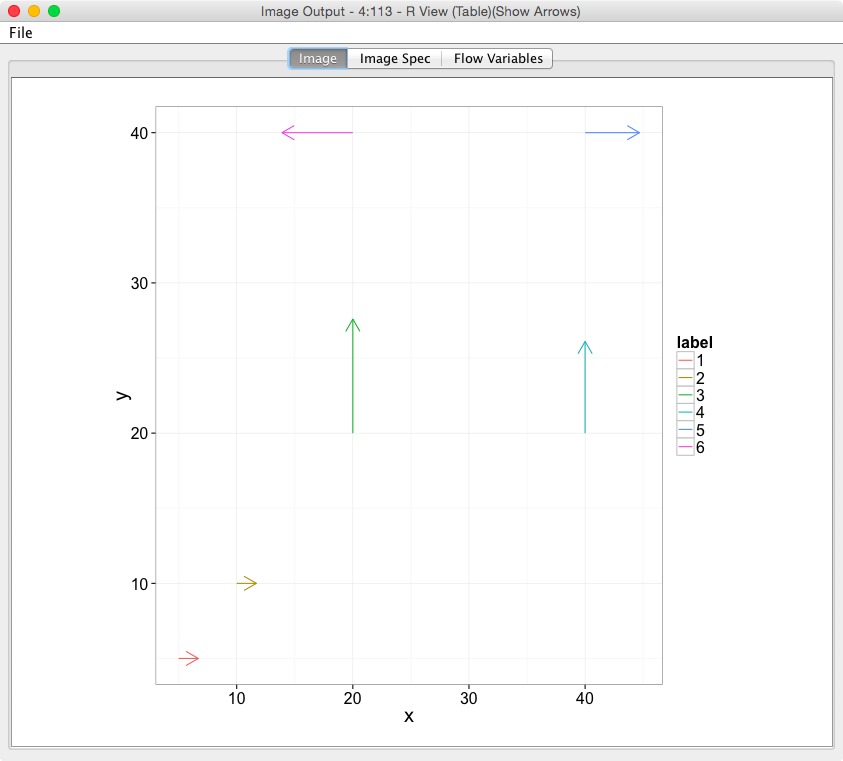

# Exercise 6: Analyzing Single Shapes

## Configure path to R within KNIME

It may happen that KNIME does not manage to automatically find the path where R is installed; in this
case, R extensions will not work within KNIME, although succefully installed through KNIME package manager.
To fix this problem, follow these instructions:

1. Open a terminal, type "R" and press Enter.
2. If R is effectively installed on your machine, an interface will be started on the terminal.
3. Type ".libPaths()" and you will get a path like "/usr/pack/r-3.0.1-bs/amd64-debian-linux7.0/lib/R/library/".
4. Open an other window on the terminal and type "ls /usr/pack/r-3.0.1-bs/amd64-debian-linux7.0/lib/R/".
5. In the list of files and folders, you should see a "/bin" and a "/lib" folder.
6. In KNIME, go to File -> Preferences; on the left panel, select "KNIME -> R".
7. Paste the path you found before (in our case "/usr/pack/r-3.0.1-bs/amd64-debian-linux7.0/lib/R/") inside
   "Path to R Home" and click "Apply".

## Part 1 - Basic Labeling

While we have done similar exercises before, we will now properly explain some of the nodes used and try to run the analysis on an image where we know exactly where each object is and compare our results with the input data.


### New Nodes
- Connected Component Analysis
 - This performs the component labeling of a segmented/thresheld image using a neighborhood. 
 - The panel allows the selection of ```FOUR_CONNECTED``` or ```EIGHT_CONNECTED``` neighborhood (which maps to 8 and 27 connected in 3D)
 - The dimensions allows for the grouping to be selected. For example for a 2D image selecting _X_ and _Y_ labels the components in the image. For a 3D image selecting _X_ and _Y_ means the components are found slice-by-slice and selecting _X_, _Y_, and _Z_ labels the components in 3D
 - 
- Label Features
 - This performs the shape analysis of the components (after labeling). It requires the specification of the metrics to be calculated for each component.
 - The features tab allows for the features to be selected which are calculated. The basic features we are interested in are Shape Geometry 
 - __Shape Geometry__ where we can pick _Centroid_ (for the relavant dimensions), and _Dimension_ which in this case means the bounding box size in the give dimension.
 - __Shape Descriptors__ contains more detailed shape information based on the distances from the centroid to the surface of the object. It can be useful for comparing complex shapes and will be covered in more detail in the next lecture.
 - 
 - The segment settings is not a feature we need immediately, but it allows for handling overlapping segments (connected components can per definition not overlap, but other labeling methods which we will cover in future lectures can). It also allows filtering (only large components or small, or based on other criteria)
 - 
- Labeling Filter
 - The labeling filter block can be used to select only a subset of the labels for further processing
 - Minimum/Maximum segment area can be set to remove small and large components
 - Border Segments can be used to remove the objects touching the edge
 - 
 
### Basic Workflow

1. Start KNIME.
2. Download this [workflow](06-files/KNIME_CellImage.zip?raw=true).
3. Import the above Workflow from an Archive.
4. Right click 'Bubble Chart' and select 'Execute and Open Views' and ensure you get a similar plot to the one below



This chart shows the overlap of the original positions (red dots) from the cell positions table and the calculate objects using component labeling and shape analysis (blue dots)

### Tasks
1. The crappy camera can be configured, try changing the noise and illumination levels, how 'crappy' can it be and still work correctly
1. Try adding some __Image Enhancement__ steps before the _Global Threshold_ step to improve the segmentation and overlap
 - which filters work best?
 - if we know that the cells are larger which other steps could be performed?
1. Change the input cell information 
 - add more cells
 - add some very large
 - some very small
 - some overlapping
 - some on the edges
 - which of the following is the most difficult?
 - Are some of these possible to reconstruct well, what sort of constraints can we place on the analysis?
1. Add a __Labeling Filter__ block to the pathway to remove small objects and then objects on the edge to try and improve the results

### Concept Questions
1. Currently we generate a graph for the output but we would like to have a metric to evaluate how well our system works, which metrics might make sense (think about the first topics covered in the lecture)
 - How might these be implemented?

## Part 2 - Ellipse Analysis
For the second part we focus on just the ellipsoidal analysis and how we calculate the orientation and anisotropy from an image without using the _Dimensions_ or bounding box which is a poor model for circular objects


### New Nodes (Advanced)
- PCA Compute
 - This performs the principal component analysis on a given set of columns from the input data. It outputs several items, the ones of interest for us are the first (scores) are the transformed input values and the second (components) are the components used to create these input values as well as the associated eigenvalues for each component.
 - For the shape analysis we use the positions of the voxels inside each image for the PCA analysis and keep the components. Each component represents a unit vector which we transform to an angle using the arc-tangent operations (atan2). The eigenvalue is then a length along this vector which we transform to anisotropy by normalizing the difference between the largest and the smallest to the length of the largest


### Basic Workflow

__Note__ The R Nodes in KNIME do not work in KNIME on the D61.1 lab computers yet, since the setup for R is unusual, but these should work locally

1. Start KNIME.
2. Download this [workflow](06-files/KNIME-EllipticalModel.zip?raw=true)
3. Import the above Workflow from an Archive.
4. Run the following code in R to ensure the correct toolboxes are installed for the more complicated plots (KNIME offers basic plotting but we use R for the nicer ones)
 - create a new terminal window, and type ```R```
 - you should get a window that says ```R version``` and some other text
 - type ```install.packages(c("ggplot2","plyr"))```
 - if it asks for ```Selection:``` type ```77```
4. Right click 'R View (Table)' and select 'Execute and Open Views' and ensure you get a similar plot to the one below showing each identified object and it's orientation as an arrow



