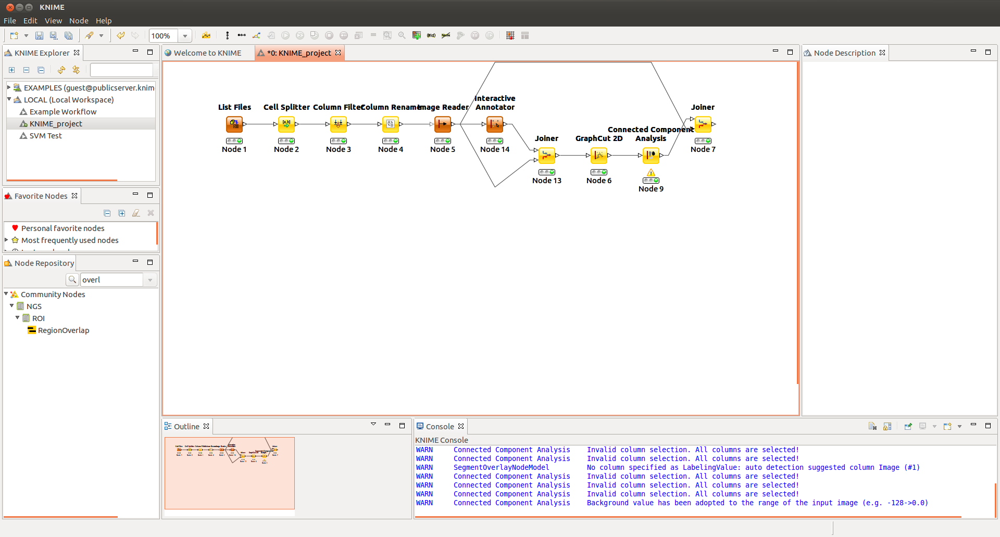
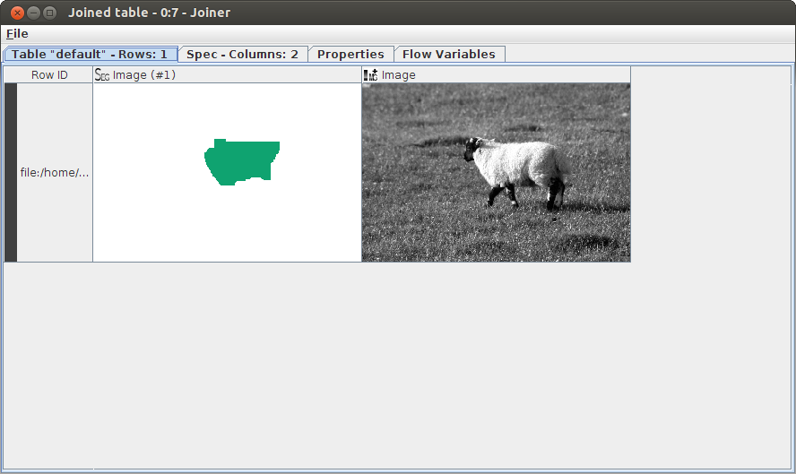
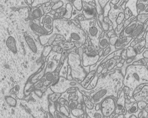
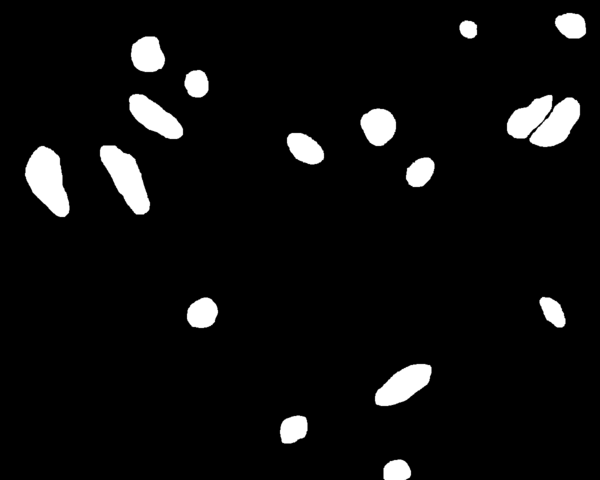

# Exercise 6: Analyzing Single Shapes

## Downloading the data

## Part 1 - Basic Labeling

Basic Workflow

1. Start KNIME.
2. Download this [workflow](05-files/KNIME_GraphCut.zip).
3. Import the above Workflow from an Archive.
4. Right click the image reader to make sure it has downloaded, otherwise you can use your own test image and import it using the 'Image Reader' (make sure to remove the old one first).
5. Click 'Execute' on the Interactive Segmentation View, at the end of the workflow.
6. View the output and it (scroll left) should look like the following table.

You can see that the result is not really good yet as GraphCut tend to remove the non-smooth parts (e.g. the legs in this example). Can you think of ways to improve the results?

## Part 2 - Image classification in KNIME

We here provide KNIME workflow to train a classifier (you can choose one among SVM, GP, Perceptron or Decision tree) to detect objects specified in a set of ground-truth images. Some images and the associated ground-truth images are provided for the segmentation of mitochondria in Electron microscopy images. We use 3 feature vectors (the same as discussed in lecture 4), Intensity, Gaussian, and Sobel and start with a basic decision tree prediction.

The goal of the exercise is to take a given input image (electron microscopy of cells) and identify the mitochondria

For this task there are a series of ground truth (labeled) images available which classify the image into the catagories of mitochondria (white) and everything else (black)

To achieve this goal we want to train a technique using some of the ground truth data and then apply it to a series of images to classify it into various categories.

### Instructions

1. Download and extract the zip file containing the images from: [set of EM images](http://lucchia.free.fr/Mitochondria/EM_images.zip)
1. Import the workflow from [here](05-files/TrainableClusteringWithEMImages.zip?raw=true)
1. Watch the video [here](https://www.youtube.com/watch?v=Y0X204avgp4)