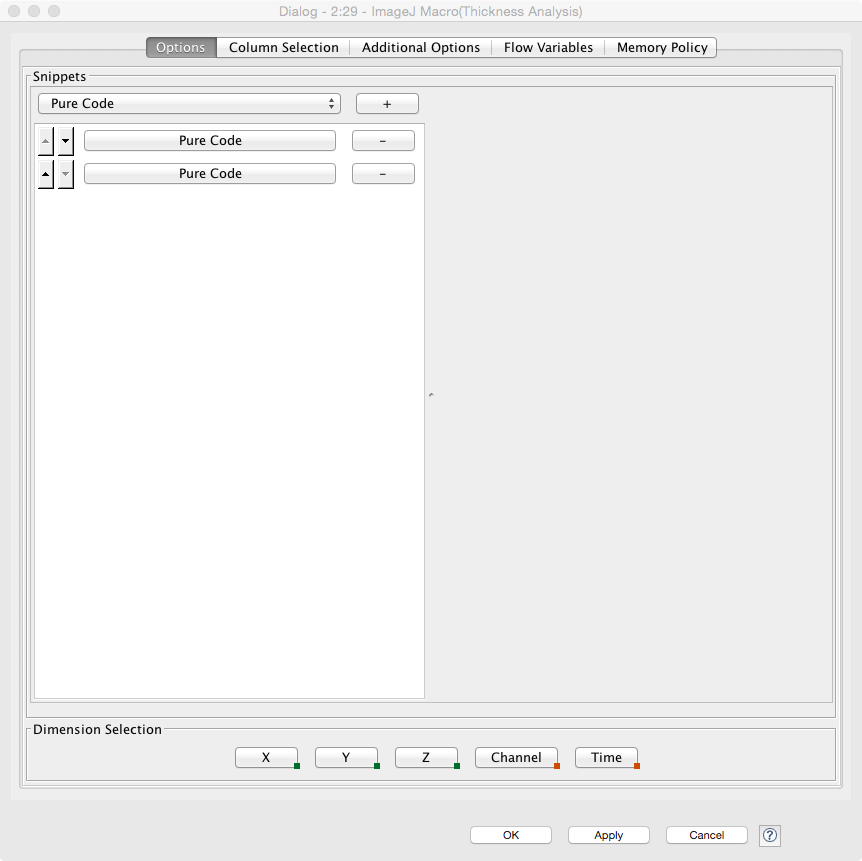
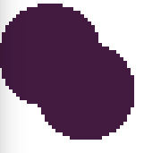
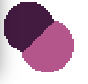

# Exercise 7: Analyzing Complex Shapes

1. FIJI / ImageJ Macro's
 - Read first about using FIJI and recording macros [here](https://github.com/kmader/Quantitative-Big-Imaging-2015/wiki/FIJI-and-Macros)
1. For this exercise you will need to enhance the set of tools KNIME has access to using the plugins built into FIJI. Follow the instructions [here](https://github.com/kmader/Quantitative-Big-Imaging-2015/wiki/KNIME-Setup#installing-fiji-plugins-imagej1-macro) for installing FIJI and setting the KNIME ImageJ1 Macro to find it's plugin folder

### New Nodes
- ImageJ1 Macro
 - This node allows you to run ImageJ macros on images in KNIME.
 - You specify the macro to run in the panel below. There are pre-built 'Snippets' which can be selected or 'Pure Code' where everything can be copy and pasted from a Macro created in ImageJ
 - 
 - The macro is then run on each image in a selected column one row at a time
 - There are two output ports, the first is the image, the second the results table
 - Most plugins do not place information in the results table, but for certain ones like histograms or thickness they will

## Setup

In this exercise you will build together a chain of analyses step by step. You import the first workflows (which have some components preassembled) and then work to build them together

### Basic Workflow

1. Start KNIME.
2. Download this [workflows](07-files/KNIME_ex7.zip).
3. Import the above Workflow from an Archive.

## Part 1 - Object Simulation (3DBlobSimulator)

In this portion you will get comfortable with making 3D objects, using similar tools to what we had before. The objects now have both a position and dimensions in X, Y, and Z.

### Tasks
1. Try using the different input tables to generate different images
1. Create grid of overlapping balls like the one shown
 - 
1. How would you create a cylinder using the position and radius ellipsoid model we have specified?


## Part 2 - Thickness Analysis

In this part you will calculate the thickness using the ImageJ plugin developed by [Bob Dougherty](http://fiji.sc/Local_Thickness) with the source code available [here](https://github.com/fiji/LocalThickness). It can be found in FIJI under the _Analyze_ -> _Local Thickness_ menu.

The workflow should at the end look something like follows.


### Tasks
1. Select all the nodes from _3DBlobSimulator_ and copy/paste (this works) them into _Thickness Analysis_
1. Connect the components together so it works
1. Verify that the thickness gives the right results by using the Line Chart blocks
1. What happens when the balls overlap?
1. What is the thickness of a cylinder? Does this make sense?
1. What happens when the object is larger than the field of view?


## Part 3 - Watershed Labeling

In this part you will use the watershed labeling and compare the results with the standard connected component labeling KNIME. The goal is to go from an image like this
- 
To an image like this
- 
Since here we assume these are two cells which just happen to be located very close to one another.

### Tasks
1. Select all the nodes from _3DBlobSimulator_ and copy/paste (this works) them into _Watershed Segmentation_
1. Connect the components together so it works
1. The 'Connected Component Analysis' should give you an image like this: 


## Part 4 - Curvature Analysis

In this part you will calculate the thickness using the ImageJ plugin developed by [Stephan Preibisch and Mark Longair](http://fiji.sc/Compute_Curvatures) with the source code available [here](https://github.com/fiji/VIB/blob/master/src/main/java/Compute_Curvatures.java). It can be found in FIJI under the _Plugins_ -> _Analyze_ -> _Compute Curvatures_ menu. 

- This requires that the ```VIB-lib-2.0.0-SNAPSHOT.jar``` file is manually copied from the FIJI/jars folder to the FIJI/Plugins folder otherwise it will not run correctly and you will see an error message

The workflow should at the end look something like follows.


The premade surface curvature node looks like this


### Tasks
1. Select all the nodes from _3DBlobSimulator_ and copy/paste (this works) them into _Thickness Analysis_
1. Connect the components together so it works
1. Verify that the thickness gives the right results by using the Line Chart blocks
1. What happens when the balls overlap?
1. What is the thickness of a cylinder? Does this make sense?
1. What happens when the object is larger than the field of view?


