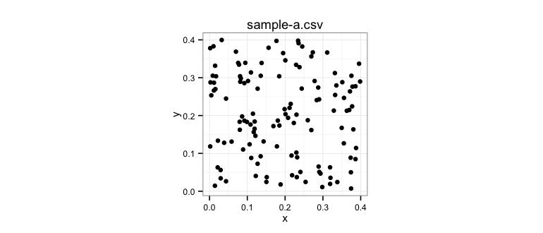
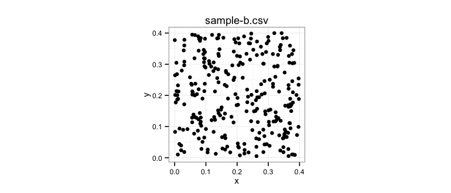
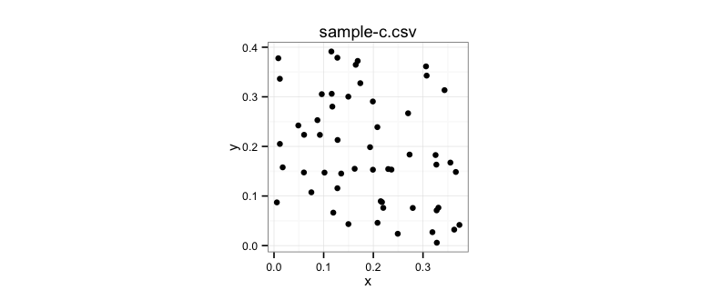
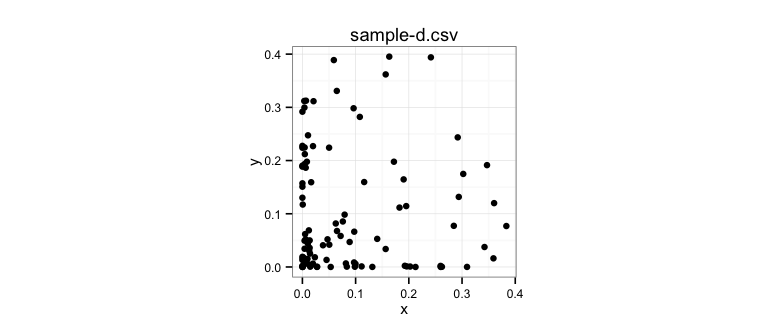
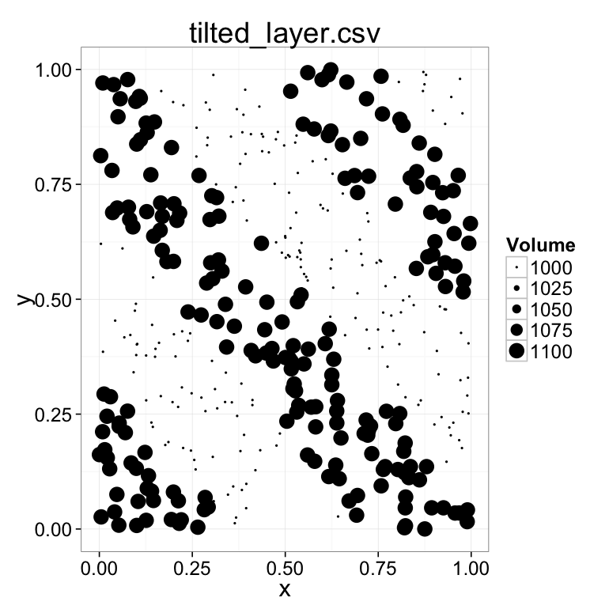
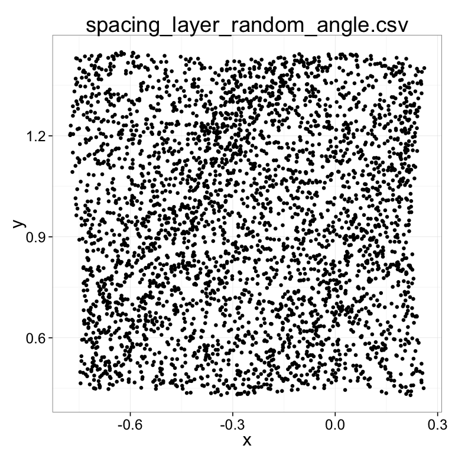
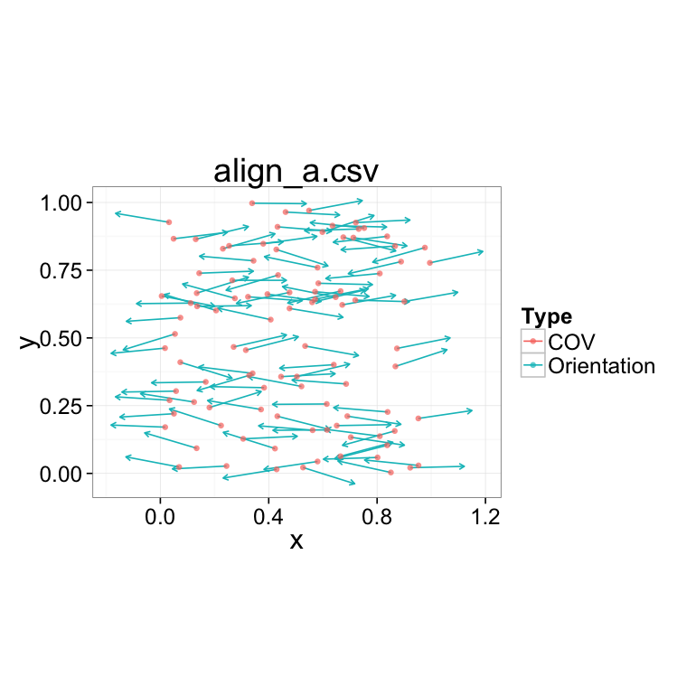
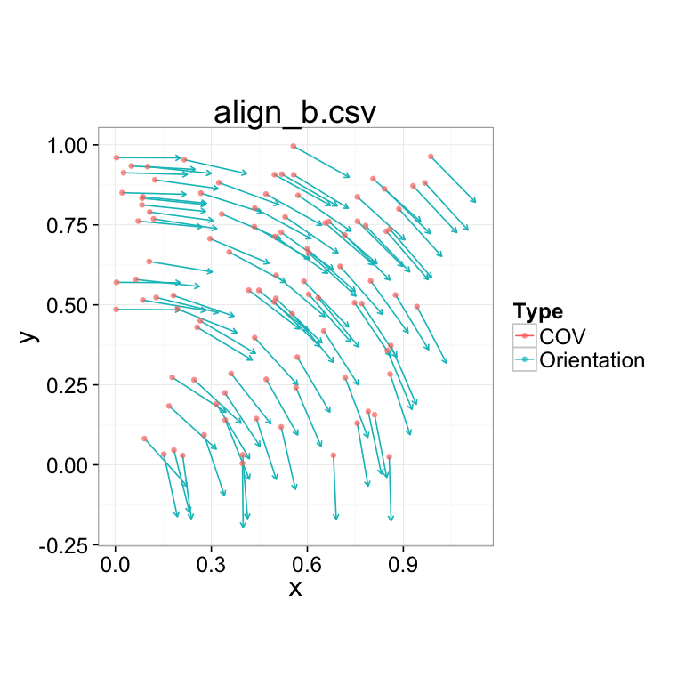

# Exercise 8:  Groups of Objects and Distributions
Kevin Mader  
April 15, 2015  


# Introductory Material

## R / RStudio

For students wishing to use R or RStudio (recommended), the exercises for this and the next exercises can also be done with these tools.

A starting script for reading in data, finding nearest neighbors, and plotting the results is available here (https://gist.github.com/kmader/9949532) and many of the other functions / examples are available in the course handout itself.

In addition many of the more advanced topics like territory, Delaunay neighbors, and distribution are only available as R code since their implementation didn't exist in KNIME

### Configuring R in KNIME
- Follow the instructions on the [wiki](https://github.com/kmader/Quantitative-Big-Imaging-2015/wiki/KNIME-Setup#configure-path-to-r-within-knime to setup) to get R setup correctly within KNIME
- Within R (start it using the R command) install the Grammar of Graphics, 'Delaunay Triangulation and Voronoi Tesselation' packages

```
install.packages(c("plyr","ggplot2","deldir"))
```

You might need to restart KNIME afterwards. 

## New Nodes

- CSV Reader
 - Reads in CSV files as a table
 - The defaults are fine for our files, except uncheck 'Has Row Header' since this will read the first column as the RowId
 - For reading XLS or other files use the other readers in the same folder
 - It can be combined with the CSV Writer to save and then load results from the 'Segment Features' or other shape analysis
 - Ideally they (Segment Features and Row Filter in the image below) are directly connected, but for testing it can be much quicker to write a CSV file out and then read it in another workflow
 - 
 
 


# Tasks

- The workflows (or their starts) are available [here](08-files/Exercise8.zip?raw=true).


## Comparing Samples


Each of these samples was measured from a different treatment group, calculate general statistics about the same and try and determine what transformation was applied from the normal (sample-a) to get to this point. _Comparing histograms of nearest neighbor positions might be a good starting point._

There are two workflows available the first is the 'Nearest Neighbors' which is entirely in KNIME (and slow). The second is the 'R Nearest Neighbors' which uses R to calculate the nearest neighor distances (faster).

The following datasets should be loaded one at a time (you can also load it using a loop if you use the 'Table Row To Variable Loop Start' and flow variables to change the name of the file in the 'CSV Reader')

- [sample-a.csv download](08-files/sample-a.csv?raw=true)

- [sample-b.csv download](08-files/sample-b.csv?raw=true)

- [sample-c.csv download](08-files/sample-c.csv?raw=true)

- [sample-d.csv download](08-files/sample-d.csv?raw=true)

### Questions/Tasks
1. Modify the workflow to exclude all neighbors which are further than 0.05 away and replace the distance with 0.05
1. How would you find the nearest 5 neighbors instead of just the nearest? (Explanation or code)?

## Finding Layers in a Sample

These layers are distinguished by __Volume__

- [simple_layer.csv download](08-files/simple_layer.csv?raw=true)

- [tilted_layer.csv download](08-files/tilted_layer.csv?raw=true)


## Finding layers by spacing
- Files have prefix spacing_
- Since these layers are distiguished by the spacing between points, you should perform a K-Means clustering.
 - The number of groups and values used to calculate the K-means can be adjusted in the panel
 - Additional math blocks can be used to rescale other values (x and y for example for inclusion)

- [spacing_layer_grid.csv download](08-files/spacing_layer_grid.csv?raw=true)

- [spacing_layer_random.csv download](08-files/spacing_layer_random.csv?raw=true)


### More layers

- [spacing_layer_grid_angle.csv download](08-files/spacing_layer_grid_angle.csv?raw=true)

- [spacing_layer_random_angle.csv download](08-files/spacing_layer_random_angle.csv?raw=true)

### Tasks
- From the K-means classification how can you count the layers automatically?
- What benefit might adding the position (x,y) into the results have?
- Would using N-nearest neighbors instead of nearest neighbor improve the results, if so for which kind of samples and why?


## Voronoi Tesselation (Pixel-based)

The goal of this task is to run a voronoi tesselation on the image to fill in the surrounding areas.

The results of the workflow should look like this
- 

### Tasks/ Questions
1. How can you calculate territory from this voronoi tesselation?
1. Create a histogram of the local density?


## Classifying Cells

Using the analysis saved [here](https://github.com/kmader/Quantitative-Big-Imaging-Course/blob/master/Ex7/analyzeParticlesOutput.txt) located in the course directory along with the sample script. To classify cells into groups, right now we just use nearest neighbor distance and area, how does adding additional parameters change the result

### Challenge: 3D analysis

3D data analyzed with KNIME or in ImageJ using the _3D Object Analyzer_ function can also be analyzed using similar workflows. Can you modify the workflow so it works for 3D positions (x,y,z) as well (in KNIME or for ambitious students in R)?

## Alignment

- Which of the two samples are more aligned? Why? 


- [align_a.csv download](08-files/align_a.csv?raw=true)

- Can you find a method for calculating the alignment better appropriately for the second sample?


- [align_b.csv download](08-files/align_b.csv?raw=true)
