# Exercise 8:  Groups of Objects and Distributions
Kevin Mader  
April 22, 2015  


# Introductory Material

## New Nodes

The new names are explained relative to the dataset used in the first problem. So read the first problem for more introductory material on these tables

## Join
 - This node takes two different tables and combines them together based on one or more __key__ values. 
 - The default option is an 'Inner' join which means the output has all of the keys which appear in __both__ the first (table A) and second (table B) table
 - There are many other possibilities 
 -  from (http://stackoverflow.com/questions/38549/difference-between-inner-and-outer-joins) 
 - In many cases inside of KNIME the 'RowID' is a reasonable key (you perform a number of operations and want to compare it to the original result)
 - For the aforementioned dataset we will apply an inner-join using the 'Join' block and matching on the _ID_ column in both 
 

  ID         BMD   MECHANICS_STIFFNESS   CORT_DTO__C_TH   CORT_DTO__C_TH_SD
----  ----------  --------------------  ---------------  ------------------
 351   0.0302208              57.16318         0.186455            0.019785
 356   0.0327883              54.97201         0.183007            0.015696
 357   0.0360747              73.59088         0.216930            0.028019
 359   0.0311451              49.85482         0.193758            0.024087

__JOIN__


  ID  D1Mit64   D1Mit236   D1Mit7   D1Mit386 
----  --------  ---------  -------  ---------
 351  H         H          H        H        
 356  H         A          A        A        
 357  H         B          B        B        
 359  A         B          B        B        

__BECOMES__ (hiding excess columns)


  ID         BMD   MECHANICS_STIFFNESS  D1Mit64   D1Mit236 
----  ----------  --------------------  --------  ---------
 351   0.0302208              57.16318  H         H        
 356   0.0327883              54.97201  H         A        
 357   0.0360747              73.59088  H         B        
 359   0.0311451              49.85482  A         B        

 
## Cross-Join

 - This join performs what is mathematically known as a Cartesian Product on the two tables
 - For those more familiar with computer programming nomenclature this is
 
```{python}
for(eleA in tableA):
  for (eleB in tableB):
    yield (eleA,eleB)
```

 - in plain language this is equivalent of combining every element with every other element
 - This is useful when performing parameter sweeps or other similar analyses where you want to try every threshold value with every sigma value with every type of filter (since you have no prior information about which one works best and they all work effectively independently)
 - Using the last table as an example (while it might initially not seem to make sense, it is actually used for measuring the error level in such systems permuting the genetic material through the original phenotype data to determine the baseline number of correlations found)
 

  ID         BMD   MECHANICS_STIFFNESS   CORT_DTO__C_TH   CORT_DTO__C_TH_SD
----  ----------  --------------------  ---------------  ------------------
 351   0.0302208              57.16318         0.186455            0.019785
 356   0.0327883              54.97201         0.183007            0.015696
 357   0.0360747              73.59088         0.216930            0.028019
 359   0.0311451              49.85482         0.193758            0.024087

__CROSS JOIN__


  ID  D1Mit64   D1Mit236   D1Mit7   D1Mit386 
----  --------  ---------  -------  ---------
 351  H         H          H        H        
 356  H         A          A        A        
 357  H         B          B        B        
 359  A         B          B        B        

__BECOMES__ (hiding excess columns)


 ID.x         BMD   MECHANICS_STIFFNESS   ID.y  D1Mit64   D1Mit236 
-----  ----------  --------------------  -----  --------  ---------
  351   0.0302208              57.16318    351  H         H        
  356   0.0327883              54.97201    351  H         H        
  357   0.0360747              73.59088    351  H         H        
  359   0.0311451              49.85482    351  H         H        
  351   0.0302208              57.16318    356  H         A        
  356   0.0327883              54.97201    356  H         A        
  357   0.0360747              73.59088    356  H         A        
  359   0.0311451              49.85482    356  H         A        
  351   0.0302208              57.16318    357  H         B        
  356   0.0327883              54.97201    357  H         B        
  357   0.0360747              73.59088    357  H         B        
  359   0.0311451              49.85482    357  H         B        
  351   0.0302208              57.16318    359  A         B        
  356   0.0327883              54.97201    359  A         B        
  357   0.0360747              73.59088    359  A         B        
  359   0.0311451              49.85482    359  A         B        

## Concatenate
- Concatenate is the last of the table operations covered today. 
- It can be thought of as combining two tables which have the same columns but different row values
- For example if we have each experiment in a separate file, it would make sense to concatenate them all together rather than _Join_ or _Cross Join_
- First table


  ID         BMD   MECHANICS_STIFFNESS   CORT_DTO__C_TH   CORT_DTO__C_TH_SD
----  ----------  --------------------  ---------------  ------------------
 351   0.0302208              57.16318         0.186455            0.019785
 356   0.0327883              54.97201         0.183007            0.015696
 357   0.0360747              73.59088         0.216930            0.028019
 359   0.0311451              49.85482         0.193758            0.024087
- Second set of results


       ID         BMD   MECHANICS_STIFFNESS   CORT_DTO__C_TH   CORT_DTO__C_TH_SD
---  ----  ----------  --------------------  ---------------  ------------------
21    457   0.0311451              49.28858         0.178971            0.020928
22    459   0.0293992              58.17281         0.158907            0.018856
23    470   0.0316586              61.49628         0.162435            0.019928
24    472   0.0345342              56.62613         0.185258            0.028595

The concatenation of the two groups


       ID         BMD   MECHANICS_STIFFNESS   CORT_DTO__C_TH   CORT_DTO__C_TH_SD
---  ----  ----------  --------------------  ---------------  ------------------
1     351   0.0302208              57.16318         0.186455            0.019785
2     356   0.0327883              54.97201         0.183007            0.015696
3     357   0.0360747              73.59088         0.216930            0.028019
4     359   0.0311451              49.85482         0.193758            0.024087
21    457   0.0311451              49.28858         0.178971            0.020928
22    459   0.0293992              58.17281         0.158907            0.018856
23    470   0.0316586              61.49628         0.162435            0.019928
24    472   0.0345342              56.62613         0.185258            0.028595

# Tasks

- The workflows (or their starts) are available [here](09-files/Workflows.zip?raw=true).

## Running basic statistical analyses

For this example we will start with a fairly complicated dataset from a genetics analysis we did at the Institute of Biomechanics. 

### Introduction
There are 1000 mouse femur bones which have been measured at high resolution and a number of shape analyses run on each sample.
- Phenotypical Information
 - Each column represents a metric which was assessed in the images
 - ```CORT_DTO__C_TH``` for example is the mean thickness of the cortical bone
 

  ID         BMD   MECHANICS_STIFFNESS   CORT_DTO__C_TH   CORT_DTO__C_TH_SD
----  ----------  --------------------  ---------------  ------------------
 351   0.0302208              57.16318         0.186455            0.019785
 356   0.0327883              54.97201         0.183007            0.015696
 357   0.0360747              73.59088         0.216930            0.028019
 359   0.0311451              49.85482         0.193758            0.024087

- Genetic Information (genoTable.csv)
 - Each animal has been tagged at a number of different regions of the genome (called markers: D1Mit236)
 - At each marker there are 3 (actually 4) possibilities
 - A is homozygous (the same from both parents) from the A strain
 - B is homozygous from the B strain
 - H is heterozygous (one from A, one from B)
 - '-' is missing or erronous measurements


        ID  D1Mit64   D1Mit236   D1Mit7   D1Mit386 
----  ----  --------  ---------  -------  ---------
101    685  A         H          H        H        
102    686  B         B          B        H        
103    687  A         A          H        H        
104    688  H         H          H        A        
105    689  H         H          -        A        

### Tasks
1. Download the two needed tables to start the analysis
- [phenoTable](09-files/phenoTable.csv?raw=true)
- [genoTable](09-files/genoTable.csv?raw=true)
1. Using the workflow 'ComparingSamples' load the data and make sure you can produce the basic plots for the histogram
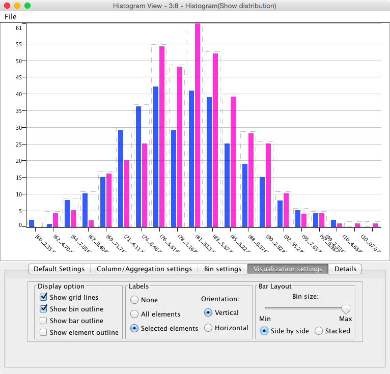
1. Explore the data and correlations between various metrics by using the 'Scatter Matrix' plotting component. Change the components to examine different variables
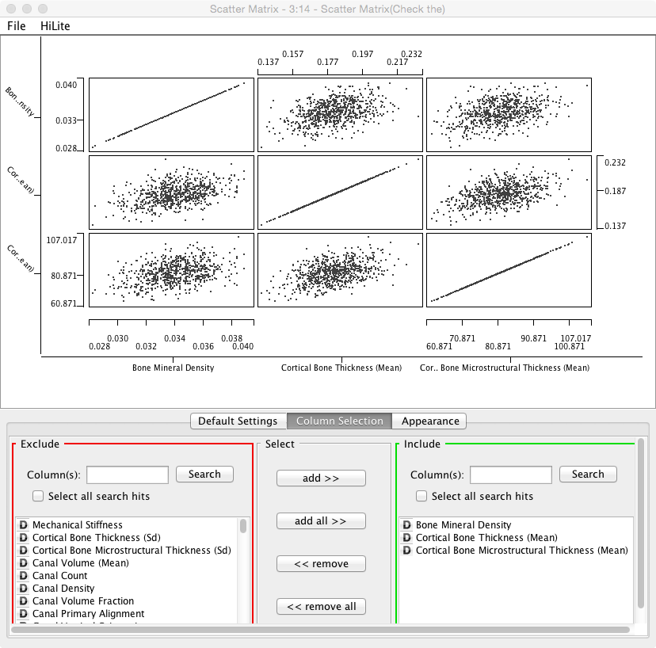
1. For the rest of the analysis you can connect the various components to the 'Column Filter' node since that is the last step in the processing
1. Use one of the T-Test nodes in the _Statistics -> Hypothesis Testing_ section to see if there is a statistically significant difference between Gender's when examining _Cortical Bone Microstructural Thickness (Mean)_
 - Which value is the p-value?
 - What does the p-value mean, is it significant, by what criterion?
1. Use another node from the _Hypothesis Testing_ section to evaluate the effect on the __D16Mit5__ on the Lacuna Distribution Anisotropy? Is it significant?

### Questions
1. In the 'Independent Groups T-Test' node we can run a t-test against all of the columns at the same time, why __SHOULDN'T__ we do this? 
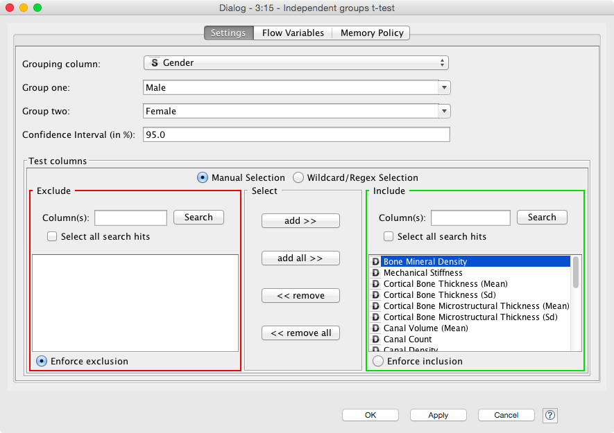
 - If we do, how do we need to interpret this in the results
 - Is p<0.05 a sufficient signifance criteria?
 
## Comparing Two Real Bone Samples
For this example we will compare two real cortical bone samples taken from mice. 
The data will be downloaded in KNIME from the course website (KNIME can also download / upload to FTP servers making sharing results and data easier). For the purpose of the analysis and keeping the data sizes small, we will use _Kevin's Crazy Camera_ again for simulating the noisy detection process.
The assignment aims to be more integrative and you will combine a number of different lectures to get to the final answer.

### Questions
1. We want to know if there is a statistically significant difference in 
 - cell volume
 - cell shape
 - cell density 
- between the two samples given the variation in the detector 
 - which metric do we need here? why?
1. We see in the volume comparison a very skewed representation of the data
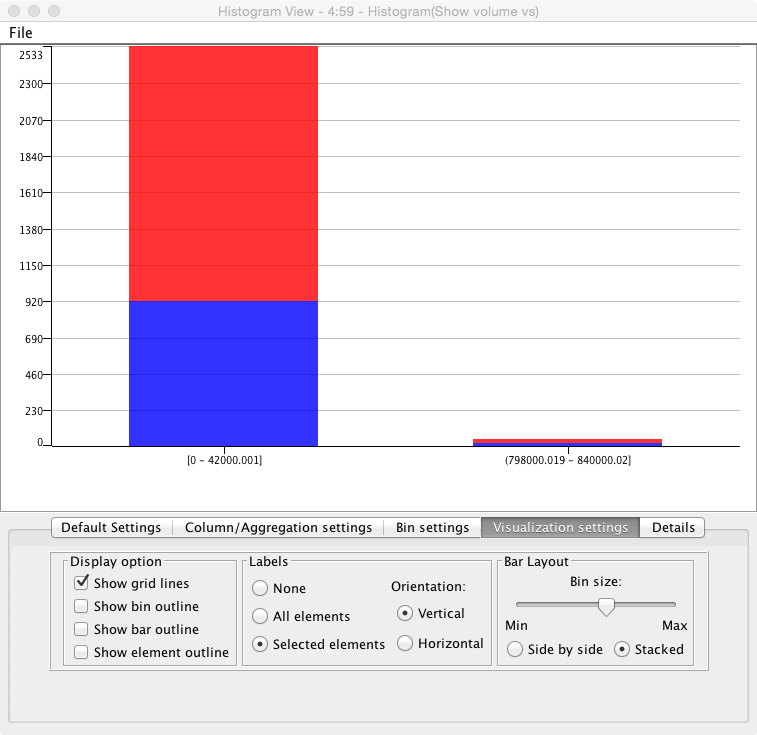
 - why is this? (Hint check the segmented images)
 - What might be done to alleviate it (hint Row Filter)
 
### Hints
1. Look at the kind of noise (you can peek inside the Crappy Camera) to choose the proper filter
1. Use an automated thresholding technique for finding the bone [automatic-methods](https://github.com/kmader/Quantitative-Big-Imaging-2015/blob/master/Exercises/04-Description.md#part-1---automatic-thresholding)
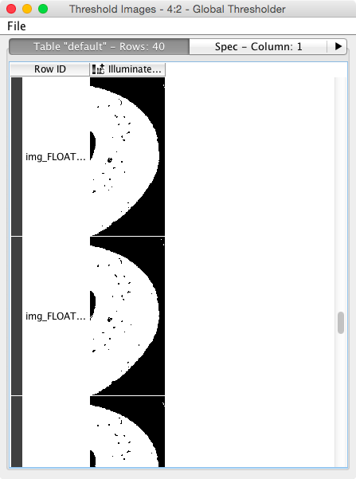
1. To do this we will need to enhance the image, segment out the bone (dense) tissue, find the mask so that we can look at the background: [contouring](https://github.com/kmader/Quantitative-Big-Imaging-2015/blob/master/Exercises/04-Description.md#part-4---contouring)
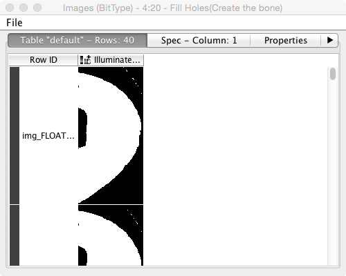
1. We then need to label the cells, and analyze their volume and shape: [labeling](https://github.com/kmader/Quantitative-Big-Imaging-2015/blob/master/Exercises/06-Description.md#part-1---basic-labeling)
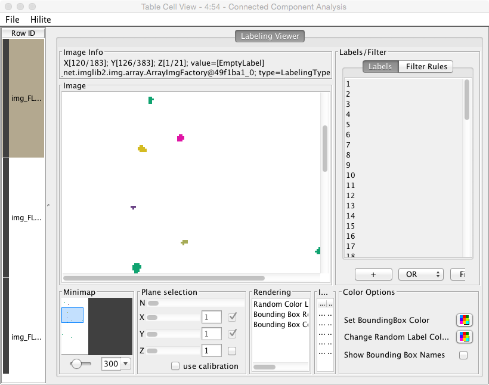
1. Use a _Chunk Loop_ for the _Segmenting Features_ node to prevent all of the features being dumped into the same output (they can afterwards be recombined with the original images using the _Join_ node)
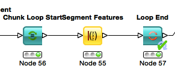
1. The final join should combine the output of the feature analysis (the end loop in this case) and the original crappy camera images. Since the _Chunk Loop_ outputs iterations, we simply use that as the __key__ for joining
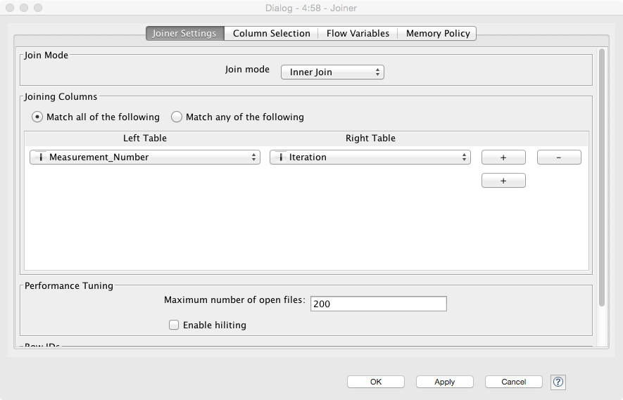
1. Use Morphology and strongy filter parameters it might be possible to maximize the differences in the groups
1. You can make the plots in R (sometimes easier than KNIME) using the _R View (Table)_ node and the following code (for volume)

```
library(ggplot2)
cur.df<-data.frame(
  sample=as.factor(knime.in$"Image Number"),
	measurement=knime.in$"Measurement_Number",
	volume=knime.in$"Num Pix"
	)
	
ggplot(cur.df,aes(x=volume))+
	geom_density(aes(color=sample,group=measurement))+
	theme_bw(25)
```

- Mean Volume
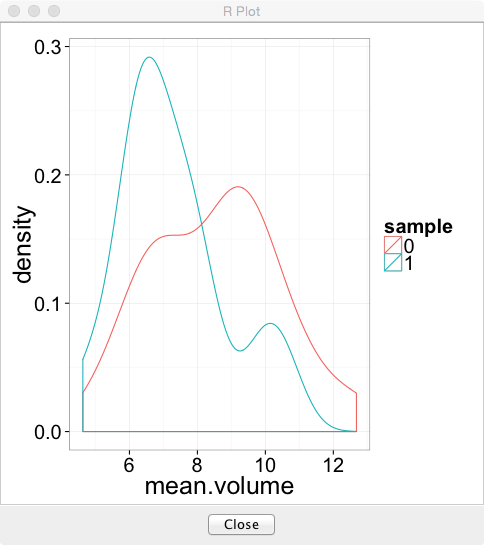

```
library(ggplot2)
library(plyr)
cur.df<-data.frame(
  sample=as.factor(knime.in$"Image Number"),
	measurement=knime.in$"Measurement_Number",
	volume=knime.in$"Num Pix"
	)
sum.df<-ddply(cur.df,.(sample,measurement),function(in.df) {
	data.frame(mean.volume=mean(in.df$volume),cell.count=nrow(in.df))
})
ggplot(sum.df,aes(x=mean.volume))+
	geom_density(aes(color=sample))+
	theme_bw(25)
```

- Cell Count

```
library(ggplot2)
library(plyr)
cur.df<-data.frame(
  sample=as.factor(knime.in$"Image Number"),
	measurement=knime.in$"Measurement_Number",
	volume=knime.in$"Num Pix"
	)
sum.df<-ddply(cur.df,.(sample,measurement),function(in.df) {
	data.frame(mean.volume=mean(in.df$volume),cell.count=nrow(in.df))
})
ggplot(sum.df,aes(x=cell.count))+
	geom_density(aes(color=sample))+
	theme_bw(25)
```

### Big Hint (don't read unless you're stuck)
One possible final result looks something like this
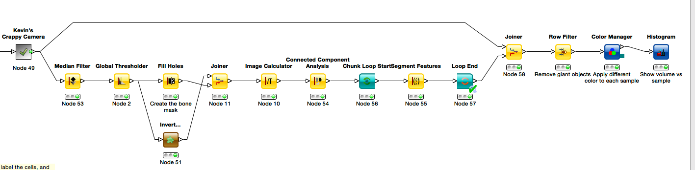
