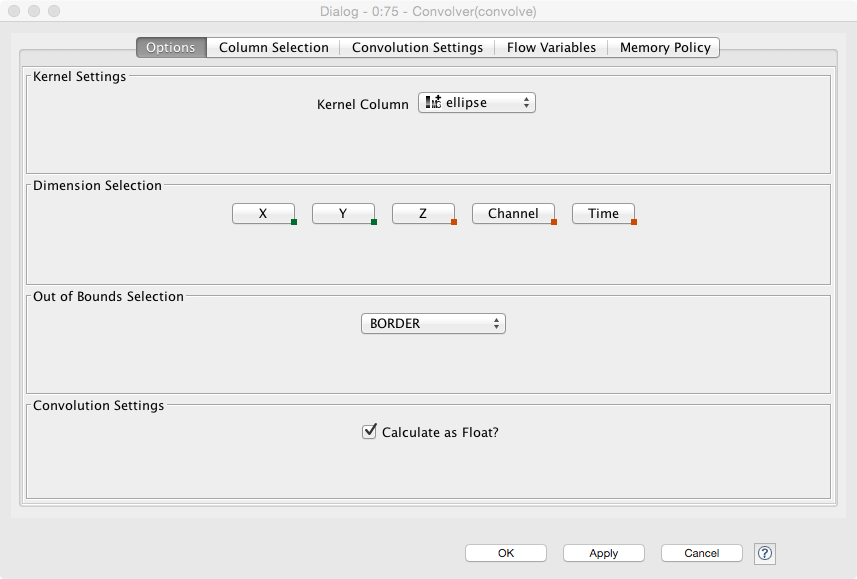
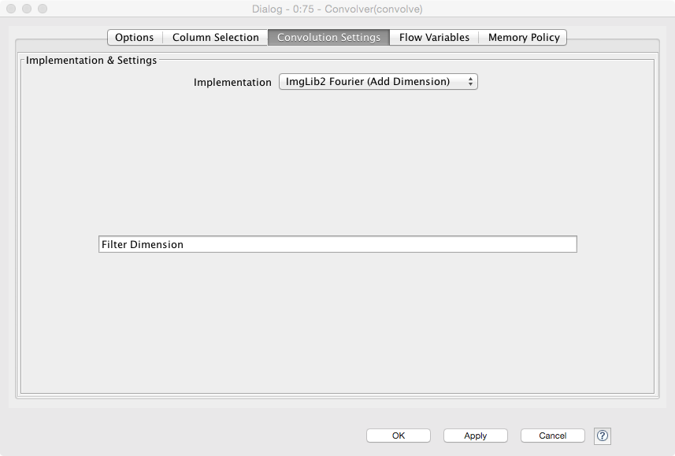

# Exercise 10: Dynamics
Kevin Mader  
April 30, 2015  

# Introductory Material

## New Nodes

The new names are explained relative to the dataset used in the first problem. So read the first problem for more introductory material on these tables

## Convolver
KNIME has a convolution node allowing for two images to be convolved using a number of different algorithms.
### Options

- 

- Kernel Column specifies which image is to be used as the kernel (can also be from the kernel creator)
- The settings for the image are specified here for 2D, select dimensions X and Y, for 3D: X, Y and Z.
- 'Out of bounds Selection' specifies what the algorithm does at the edge of the image
 - _BORDER_ specifies padding with the same values as the edge
 - _ZERO VALUE_ specifies zero padding
 - _MIRROR SINGLE_ will mirror the values at the edge
 - _PERIODIC_ will periodically repeat the values
- 'Calculate as Float' specifies the output as a floating point number (otherwise it might calculate it as the same type as the image which may not be precise enough)

### Convolution Settings
- 
- Here the implementation can be specified, the Fourier-based methods should in most cases be faster (for very small images / kernels they might be slower)

## Convolution Kernel Creator
In the KNIME Image Processing -> IO -> Other, there is a Kernel creator which can be used to specify common kernels as covered in the 'Image Enhancement' lecture.

# Exercises

- The workflows (or their starts) are available [here](10-files/Ex10Dynamic.zip?raw=true).

## Convolution-based Tracking

Start with the _2D-Tracking_ workflow. Run the analysis and ensure that the output image from the Line Chart looks as follows:

### Questions
1. Looking at the individual frames from the output of the 'Synthetic 2D Movie Maker' how would you expect the results of the tracking to look? (Verify this by looking at how the frames is actually generated inside this node)
 - Why is this curve so rough? What could be done to improve the tracking?
1. After the 'Synthetic 2D Movie Maker' node there is a Math Formula and a join, what is the role of this? How long is the length of the output of the join, why? 

## Object-based Tracking

Using the `2D-Object Tracking' workflow, you will utilize the methods covered in the Analysis of Many Objects lecture (Nearest Neighbor) to track objects from one frame to the next. 

### Tasks

1. At the output of the 'Rule-based Filter' you have a list of objects at time _t_ matched with all objects at time _t+1_. How can the idea of nearest neighbor be used to match the objects?
1. Increase the noise (in the 'Synthetic 2D Movie Maker' configure panel) to 5 or above, what happens to the results (look at the component labeled images)? How might this problem be corrected for?
1. Change the Movie Maker to move the object in X instead of Y
 
### Questions
1. What additional criteria might be added to improve this result under noisy circumstances?
1. What happens when an object completely leaves the field of view?
1. How might the tracking be extended so the entire lifespan of an object can be tracked?

## 2D Deformation Tracking

In this example we will measure the deformation in a synthetic system. The system (shown below) is undergoing compression and we would like to measure this. The files are located [here](10-files/compress.zip?raw=true).

### Questions
1. Which techniques would work for assessing the level of compression?
1. Would cross correlation be applicable? What changes would need to be made?

### Tasks
1. Take the 2D image tracking workflow to track the movement of the dots (read in the images instead of using the simulator )
1. Use the 2D tracking workflow to apply cross correlation to the dataset, how well does it work, why?
1. Use the 2D deformation workflow
 - 
 - Why does it need to be so complicated?
 - Ensure the result you get looks like this
 - 
 - From this field how would you calculate strain or deformation?

## 3D Object-based Tracking

Start with the '3D-Tracking' workflow which generates 3D movies of whatever shape is specified in the table creator

### Tasks
1. Using results from the 2D results above, modify the workflow to track the 3D movie.
1. Add noise to the images (Salt and Pepper) and try to track the image by using filtering and other steps

## Optional: [TrackMate](http://fiji.sc/TrackMate)

FIJI offers a number of plugins to perform tracking. One of the most flexible is called TrackMate (Plugins$\rightarrow$ Tracking $\rightarrow$ TrackMate), 

It can also be well integrated into Matlab-based workflows (http://fiji.sc/Using_TrackMate_with_MATLAB)

Tutorial Movie with Second Flow: http://people.ee.ethz.ch/~maderk/videos/TrackMate.ogv

Using Trackmate in KNIME, workflow (from the KNIME site) is [here](http://tech.knime.org/files/knimeip/workflows/Example_Trackmate.zip)

