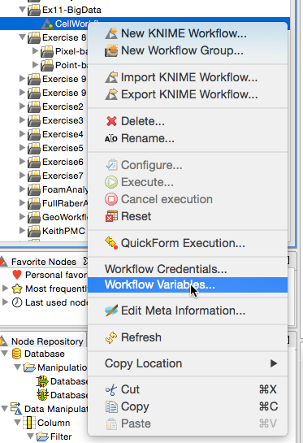
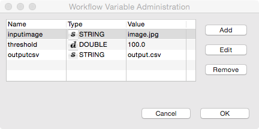

# Exercise 11: Scaling Up / Big Data
Kevin Mader  
May 7, 2015  


# Objectives

1. Make a basic job using Condor
1. Make an parameter sweep using Condor
1. Use a 'big data' tool for basic image processing

# Introductory Material

## KNIME Ideas
### Workflow Variables
These are variables for the workflow which can be changed each time the workflow is run sort of a specific run configuration (containing parameters or filenames)

- Inside a workflow itself it is setup in the following panel located by right clicking the workflow

- 

- 

It's possible to change the configuration of the workflow through workflow variables. If a variable is defined for a workflow, you can use it in batch mode by referring to it using a comma separated triplet to specify the name, value and type like this:


```bash
-workflow.variable=my_integer,5,int
```

### Batch Mode / Headless
In order to run a workflow, named "Knime_project" contained in the workspace directory, execute in one line: 
```
knime -nosplash -application org.knime.product.KNIME_BATCH_APPLICATION -workflowDir="workspace/Knime_project"
```

In order to run a workflow, name "Knime_project.zip" exported as an .zip file, execute in one line:

```
knime -nosplash -application org.knime.product.KNIME_BATCH_APPLICATION -workflowFile="PATH_TO_FILE/Knime_project.zip"
```

### Condor Scripts


Condor (like Sun Grid Engine) is a queue processing system. It manages a cluster (large collection of computers connected with a network and sharing some if not all storage) and distributes tasks to each computer. 
Job (task) is a single task to be executed containing information on where the data is located and what should be done with the data.

### Condor at ITET

The instructions and specific details for [Condor at ITET](https://computing.ee.ethz.ch/Services/Condor) 

### Basic Commands
- Submit a job ```condor_submit```
- Check the status of jobs ```condor_q```
- Delete a job ```condor_rm```
- Delete all jobs ```condor_rm -all```

# Tasks

## First Demo Script (Matlab)

The demo script is provided by D-ITET and can be run by typing ~~jobs cannot be run from the scratch folder~~

```bash
cd ~/
git clone https://gist.github.com/a49814356c7e707bb0dc.git
cd a49814356c7e707bb0dc
chmod +x mandelbrot.sh
condor_submit mandelbrot.condor
```

## Cell Colony Demo Workflow

A script to try a number of thresholds on the cell colony image

```bash
cd ~/
git clone https://gist.github.com/5b1d261aac240fed5a58.git
cd 5b1d261aac240fed5a58
chmod +x filterandthreshold.sh
condor_submit batchimage.condor
```
### Tasks
1. Modify the workflow to apply a gaussian filter with a varying sigma instead of a varying threshold
1. Have the script save the output image as well


# Apache Spark

## Install Spark (Advanced)


```bash
cd /scratch
curl -o spark.tgz http://d3kbcqa49mib13.cloudfront.net/spark-1.3.1-bin-hadoop2.6.tgz
tar -xvf spark.tgz
cd spark-1.3.1-bin-hadoop2.6/
```

### Starting Spark

[Spin up your own cluster in an hour](https://amplab.cs.berkeley.edu/2013/10/23/got-a-minute-spin-up-a-spark-cluster-on-your-laptop-with-docker/)
~~ we only use it on one node acting as the master, scheduler, and worker, but normally it is run on different computers ~~
- Start the Spark-Shell ```./bin/spark-shell```
 - Write code in [Scala](http://www.scala-lang.org/what-is-scala.html)
- Start Spark-python ```./bin/pyspark```
 - Write code in Python

### Getting an image to Key-Value Format


```r
library(jpeg)
in.img<-readJPEG("11-files/input_image.jpg")
kv.img<-im.to.df(in.img)
write.table(kv.img,"cell_colony.csv",row.names=F,col.names=F,sep=",")
kable(head(kv.img))
```


  x    y         val
---  ---  ----------
  1    1   0.6274510
  2    1   0.7803922
  3    1   0.8862745
  4    1   0.8980392
  5    1   0.9098039
  6    1   0.9215686
The key is position $\langle x, y \rangle$ and value is the intensity $val$

## Loading the data into Spark (Scala)

The text file to download: [cell_colony.csv](11-files/cell_colony.csv)


```scala
val rawImage=sc.textFile("cell_colony.csv")
val imgAsColumns=rawImage.map(_.split(","))
val imgAsKV=imgAsColumns.map(point => ((point(0).toInt,point(1).toInt),point(2).toDouble))
```

- Count the number of pixels


```scala
imgAsKV.count
```

- Get the first value


```scala
imgAsKV.take(1)
```

- Sample 100 values from the data


```scala
imgAsKV.sample(true,0.1,0).collect
```

## Perform a threshold


```scala
val threshVal=0.5
val labelImg=imgAsKV.filter(_._2<threshVal)
```

- Runs on 1 core on your laptop or 1000 cores in the cloud or on Merlin or the beamline.
- If one computer crashes or disconnects it __automatically__ continues on another one. 
- If one part of the computation is taking too long it will be sent to other computers to finish
- If a computer runs out of memory it writes the remaining results to disk and continues running (graceful dropoff in performance )

## Get Volume Fraction


```scala
100.0*labelImg.count/(imgAsKV.count)
```

## Region of Interest

Take a region of interest between 0 and 100 in X and Y

```scala
def roiFun(pvec: ((Int,Int),Double)) = 
 {pvec._1._1>=0 & pvec._1._1<100 & // X
  pvec._1._2>=0 & pvec._1._2<100 } //Y
val roiImg=imgAsKV.filter(roiFun)
```


## Perform a 3x3 box filter


```scala
def spread_voxels(pvec: ((Int,Int),Double), windSize: Int = 1) = {
  val wind=(-windSize to windSize)
  val pos=pvec._1
  val scalevalue=pvec._2/(wind.length*wind.length)
  for(x<-wind; y<-wind) 
    yield ((pos._1+x,pos._2+y),scalevalue)
}

val filtImg=roiImg.
      flatMap(cvec => spread_voxels(cvec)).
      filter(roiFun).reduceByKey(_ + _)
```

## Setting up Component Labeling

- Create the first labels from a thresheld image as a mutable type


```scala
val xWidth=100
var newLabels=labelImg.map(pvec => (pvec._1,(pvec._1._1.toLong*xWidth+pvec._1._2+1,true)))
```

- Spreading to Neighbor Function


```scala
def spread_voxels(pvec: ((Int,Int),(Long,Boolean)), windSize: Int = 1) = {
  val wind=(-windSize to windSize)
  val pos=pvec._1
  val label=pvec._2._1
  for(x<-wind; y<-wind) 
    yield ((pos._1+x,pos._2+y),(label,(x==0 & y==0)))
}
```

## Running Component Labeling


```scala
var groupList=Array((0L,0))
var running=true
var iterations=0
while (running) {
  newLabels=newLabels.
  flatMap(spread_voxels(_,1)).
    reduceByKey((a,b) => ((math.min(a._1,b._1),a._2 | b._2))).
    filter(_._2._2)
  // make a list of each label and how many voxels are in it
  val curGroupList=newLabels.map(pvec => (pvec._2._1,1)).
    reduceByKey(_ + _).sortByKey(true).collect
  // if the list isn't the same as before, continue running since we need to wait for swaps to stop
  running = (curGroupList.deep!=groupList.deep)
  groupList=curGroupList
  iterations+=1
  print("Iter #"+iterations+":"+groupList.mkString(","))
}
groupList
```

### Calculating From Images

- Average Voxel Count


```scala
val labelSize = newLabels.
  map(pvec => (pvec._2._1,1)).
  reduceByKey((a,b) => (a+b)).
  map(_._2)
labelSize.reduce((a,b) => (a+b))*1.0/labelSize.count
```

### Center of Volume for Each Label


```scala
val labelPositions = newLabels.
  map(pvec => (pvec._2._1,pvec._1)).
  groupBy(_._1)
def posAvg(pvec: Seq[(Long,(Int,Int))]): (Double,Double) = {
val sumPt=pvec.map(_._2).reduce((a,b) => (a._1+b._1,a._2+b._2))
(sumPt._1*1.0/pvec.length,sumPt._2*1.0/pvec.length)
}
print(labelPositions.map(pvec=>posAvg(pvec._2)).mkString(","))
```
